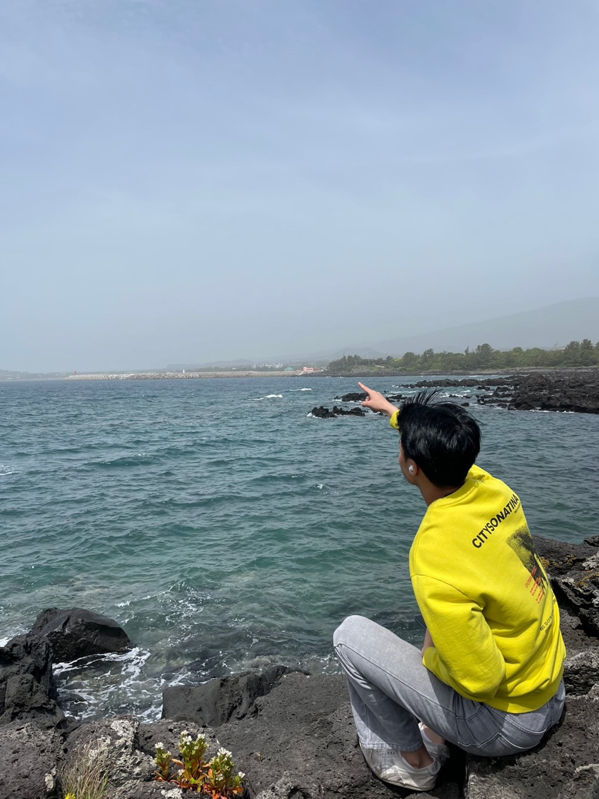

# My blog is having its Grand-Opening today!

```python
def opening():
    print("Hello Github!")
    
def aboutMe():
    print("I'm studying programming languages and doing some project on my own now.\n")
    print("and I also posting about another studies.\n")
    print("I really hope you to get something useful on my blog.\n")
    print("This description will continue to be modified.")
opening()
aboutMe()

```



***

<u>🚨<span style = "color:green">Real time posting available</span>🚨</u>

***

